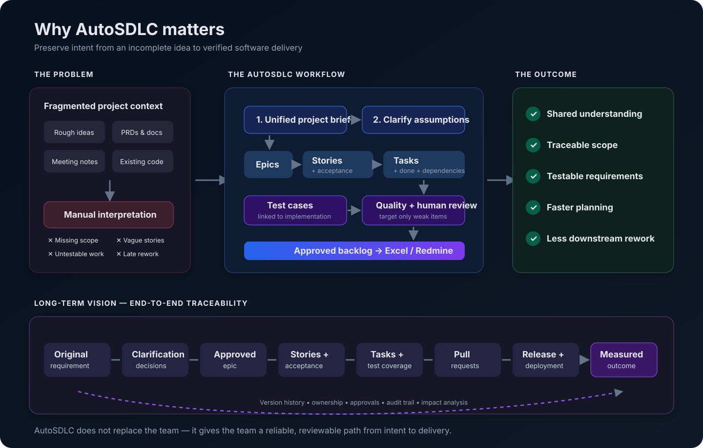

# AutoSDLC Story Generator

AutoSDLC turns a project brief into a reviewable software backlog containing epics, user stories, implementation tasks, and test cases. It provides a React web application, a FastAPI API, SQLite persistence, quality scoring and repair tools, Excel export, and optional Redmine synchronization.

This README is the onboarding and operating manual for new team members. Start with **First-day setup**, then use the sections below as the day-to-day reference.

## Why this application exists

Software projects rarely begin with implementation-ready requirements. Teams receive rough ideas, meeting notes, PRDs, uploaded documents, stakeholder assumptions, and sometimes an existing repository. Product managers and engineering leads must manually turn that fragmented context into a hierarchy that developers can implement and QA can verify.

That manual translation is slow and inconsistent. Requirements lose their original intent, stories lack testable acceptance criteria, tasks omit dependencies and failure handling, and missing scope is discovered after development begins. A generic AI chat can produce ticket-shaped text, but it does not provide persistent hierarchy, controlled review phases, traceability, quality gates, history, or delivery-tool synchronization.

AutoSDLC is the structured bridge between project intent and engineering execution:



The application does not replace product managers, architects, developers, or QA. It removes repetitive backlog drafting, preserves requirement intent, exposes missing context early, and gives each discipline a structured artifact to review.

### Who receives value

| Role | Value provided by AutoSDLC |
| --- | --- |
| Product manager / Business analyst | Converts source material into structured scope and identifies unresolved assumptions early |
| Engineering lead / Architect | Reviews technical completeness, dependencies, risks, and non-functional requirements before execution |
| Developer | Receives actionable tasks with context, dependencies, estimates, and explicit completion conditions |
| QA engineer | Receives testable acceptance criteria and test cases connected to their parent stories and tasks |
| Delivery manager | Reviews scope and quality, then publishes approved work into the delivery system |
| New team member | Understands the project through a single navigable epic-to-test hierarchy |

### Long-term direction

The long-term goal is not merely to generate tickets. AutoSDLC should become the traceability layer connecting a business requirement to verified, delivered software, as shown in the lower half of the diagram above.

The roadmap progresses through six capabilities:

1. **Trustworthy generation:** stronger clarification, source-to-item traceability, duplicate and contradiction detection, and safe incremental regeneration.
2. **Human collaboration:** comments, approvals, ownership, version comparison, audit history, and real backend authorization.
3. **Planning intelligence:** dependency graphs, critical paths, delivery-risk estimation, capacity planning, and coverage reporting.
4. **Delivery integrations:** two-way Redmine synchronization plus Jira, Azure DevOps, and GitHub Issues.
5. **Engineering execution:** repository-aware planning and links from backlog items to code, tests, pull requests, and releases.
6. **Enterprise readiness:** SSO, tenant isolation, production data storage, background jobs, observability, governance, and private deployment.

## What you will work with

| Layer | Technology | Purpose |
| --- | --- | --- |
| Frontend | React 19, TypeScript, Vite | Brief entry, generation, review, editing, history, and Redmine workflows |
| Backend | Python 3.11+, FastAPI | Streaming generation, validation, persistence, export, and integration APIs |
| AI access | LiteLLM plus local adapters | Cloud-provider fallback, quota tracking, Ollama, and LM Studio support |
| Storage | SQLite | Generations, backlog items, application settings, and usage counters |
| Integration | Redmine REST API | Project creation and hierarchical issue publishing |

The generation sequence is:

```text
Brief -> optional clarification -> Epics -> Stories -> Tasks -> Test Cases
      -> validation and quality scoring -> review/edit -> Excel or Redmine
```

## First-day setup

### Prerequisites

Install:

- Python 3.11 or newer
- Node.js 20 or newer and npm
- Git
- Docker with Compose, only if you want the containerized app or local Redmine
- At least one configured AI provider, or a running Ollama/LM Studio instance

Never commit `.env`, provider keys, Redmine keys, `autosdlc.db`, or generated logs.

### 1. Configure and install the backend

Run these commands from the repository root:

```bash
python3 -m venv venv
source venv/bin/activate
pip install -r requirements.txt
pip install -r requirements-dev.txt
cp .env.example .env
```

On Windows PowerShell, activate the environment with:

```powershell
.\venv\Scripts\Activate.ps1
```

Edit `.env` and replace the placeholder for at least one provider. The default provider is Groq:

```dotenv
AI_PROVIDER=groq
GROQ_API_KEY=replace_me
GROQ_MODEL=llama-3.3-70b-versatile
```

The provider saved from the Admin settings UI takes precedence over `AI_PROVIDER`. If the database has no saved selection, the environment value is used.

### 2. Install the frontend

```bash
cd frontend
npm ci
cd ..
```

Use `npm ci` for a reproducible install from `package-lock.json`. Use `npm install` only when intentionally changing dependencies.

### 3. Start the development servers

Use two terminals from the repository root.

Terminal 1 — API:

```bash
source venv/bin/activate
uvicorn main:app --reload
```

Terminal 2 — UI with hot reload:

```bash
cd frontend
npm run dev
```

Open <http://127.0.0.1:5173>. Vite proxies API calls to FastAPI at `127.0.0.1:8000`.

Confirm the environment:

```bash
curl http://127.0.0.1:8000/health
pytest
cd frontend && npm run build && npm run lint
```

FastAPI's interactive API reference is available at <http://127.0.0.1:8000/docs> while the backend is running.

## Running the production-style build locally

Vite writes its production bundle into `static/`, which FastAPI serves. The directory is generated and must not be hand-edited.

```bash
cd frontend
npm run build
cd ..
uvicorn main:app --host 0.0.0.0 --port 8000
```

Open <http://127.0.0.1:8000>.

## Running with Docker

The multi-stage Docker build compiles the frontend and packages the backend. SQLite data is retained in the `story_generator_db` volume.

```bash
cp .env.example .env
# Add provider credentials to .env first.
docker compose up --build
```

Open <http://127.0.0.1:8000>. Change the host port when needed:

```bash
APP_HOST_PORT=8080 docker compose up --build
```

Useful commands:

```bash
docker compose logs -f story-generator
docker compose down
```

Do not run `docker compose down -v` unless you intentionally want to delete the persisted application database.

## Product user manual

### Navigation

| Area | Use it for |
| --- | --- |
| Brief | Paste a structured brief or load the project brief template |
| Chat | Describe a project conversationally and answer focused clarification questions |
| Upload | Extract a brief from a `.md` or `.docx` file |
| Assistant | Query or update Redmine issues and start supported backlog workflows |
| Backlog | Review the active generation by overview, epics, stories, tasks, test cases, or hierarchy |
| History | Reopen or delete persisted generations |

On phones, these destinations appear in the fixed bottom navigation. Backlog URLs include the generation ID and view, so they can be bookmarked or opened in another tab.

### Create a backlog

1. Choose **Brief**, **Chat**, or **Upload**.
2. Open **Quality & Context settings**.
3. Keep clarification enabled when the input is incomplete. The assistant asks a bounded number of focused questions and then continues.
4. Choose a generation flow:
   - **Step through each phase** pauses after epics, stories, tasks, and test cases so you can review before continuing.
   - **Generate everything at once** runs the complete pipeline and is available only to the Admin role.
5. Start generation and leave the tab open while streaming is active.
6. Review the output in **Backlog**. Use the dedicated phase pages for focused review and the hierarchy page to inspect parent-child relationships.

Stepwise mode is the default for new users because it makes early errors cheaper to catch. A detailed brief with actors, workflows, constraints, integrations, security needs, and failure behavior produces better results than a short feature list.

Use [`docs/PROJECT_BRIEF_TEMPLATE.md`](docs/PROJECT_BRIEF_TEMPLATE.md) for new briefs. For source material that is not yet a brief, use:

- [`prompts/IDEA_TO_PROJECT_BRIEF.md`](prompts/IDEA_TO_PROJECT_BRIEF.md) for a rough idea
- [`prompts/EXTRACT_FROM_DOCS.md`](prompts/EXTRACT_FROM_DOCS.md) for product documents or notes
- [`prompts/EXTRACT_FROM_REPO.md`](prompts/EXTRACT_FROM_REPO.md) for an existing codebase

### Review and improve quality

The backlog overview provides counts, validation results, quality dimensions, gaps, and trust information. During review:

1. Inspect weak quality dimensions and the exact items responsible.
2. Select only the weak items you want the AI to improve.
3. Run the targeted improvement and review the attempt result; “updated” does not necessarily mean the item cleared the quality threshold.
4. Repair task dependencies when a legacy or edited backlog contains invalid references.
5. Edit item text, status, priority, and task assignee directly where the UI permits.
6. Recheck the trust gate before publishing to Redmine.

Avoid blindly regenerating a nearly-correct backlog. Targeted repair preserves reviewed work and costs fewer provider calls.

### Export and history

- **Export to Excel** downloads the persisted generation with its backlog hierarchy.
- **History** lists stored runs and lets you reopen a generation.
- A reopened generation uses its route-backed ID rather than relying only on browser session state.
- Local development stores data at `app/services/autosdlc.db` unless `AUTOSDLC_DB_PATH` is set.
- Docker stores data at `/app/data/autosdlc.db` in the persistent volume.

### Roles and permissions

The role selector is a workflow aid, not authentication. It is stored in browser `localStorage`; backend endpoints are currently unauthenticated.

| Capability | Admin | Manager | Contributor |
| --- | :---: | :---: | :---: |
| Stepwise generation | Yes | Yes | Yes |
| One-click generation | Yes | No | No |
| Change AI provider | Yes | No | No |
| Workflow visualizer | Yes | No | No |
| Push to Redmine | Yes | Yes | No |

Do not treat this matrix as a security boundary in an internet-facing deployment. Add backend authentication and authorization before exposing the service publicly.

## AI provider configuration

Cloud providers visible in the Admin provider picker are Groq, Mistral, OpenRouter, and Google Gemini. Configure any combination; the service can fall back to another configured provider when the active provider fails or exhausts quota.

```dotenv
GROQ_API_KEY=
GROQ_MODEL=llama-3.3-70b-versatile

MISTRAL_API_KEY=
MISTRAL_MODEL=mistral-large-latest

OPENROUTER_API_KEY=
OPENROUTER_MODEL=nvidia/nemotron-3-super-120b-a12b:free

GEMINI_API_KEY=
GEMINI_MODEL=gemini-3.5-flash-lite
```

Self-hosted providers are selected through `AI_PROVIDER` and are not shown in the provider picker:

```dotenv
# Ollama
AI_PROVIDER=ollama
OLLAMA_BASE_URL=http://localhost:11434
OLLAMA_MODEL=llama3.1

# Or LM Studio
AI_PROVIDER=lmstudio
LMSTUDIO_BASE_URL=http://localhost:1234
LMSTUDIO_MODEL=google/gemma-4-e4b
```

Hugging Face is also supported through `AI_PROVIDER=huggingface`, `HUGGINGFACE_API_KEY`, and `HUGGINGFACE_MODEL`.

Provider selection and quota counters are persisted in SQLite. The live refresh action may make a minimal provider request to verify reachability or read rate-limit headers.

## Redmine user workflow

To publish a backlog:

1. Open the Redmine panel from a completed backlog.
2. Enter the Redmine URL and API key.
3. Connect, then select an existing project or create one.
4. Choose the required scope and review trust-gate warnings.
5. Push the issues and verify the resulting hierarchy in Redmine.

The browser stores Redmine connection settings in `localStorage`; treat shared browser profiles accordingly. Redmine API calls are made by the backend.

For a local integration environment, follow [`redmine/local/README.md`](redmine/local/README.md). It starts Redmine on port `3001` and provisions the Epic, Story, and Task trackers. When AutoSDLC itself runs in Docker, use `http://host.docker.internal:3001` in its Redmine dialog instead of `localhost`.

## Repository map

```text
.
├── main.py                     FastAPI routes and generation orchestration
├── app/
│   ├── core/                   Deterministic generation and quality rules
│   ├── schemas/                Pydantic request and domain models
│   ├── services/               Providers, prompts, database, metrics, export
│   └── utils/                  SSE, parsing, rate limits, and error handling
├── frontend/src/
│   ├── api/                    Typed backend client
│   ├── components/             UI, tabs, backlog views, and modals
│   ├── hooks/                  Generation, role, theme, and toast state
│   ├── lib/                    Routes, phases, formatting, and permissions
│   └── styles/                 Tokens, primitives, and global styles
├── redmine/                    Redmine client and local Docker environment
├── tests/                      Backend and route regression tests
├── docs/                       Active briefs, guides, architecture, and archive
├── prompts/                    Brief preparation prompts
├── static/                     Generated production frontend bundle
├── Dockerfile
└── docker-compose.yaml
```

Important ownership boundaries:

- `main.py` coordinates HTTP and streaming; reusable business logic belongs under `app/`.
- `app/schemas/models.py` is the contract shared by generation, storage, and the API.
- `app/services/providers.py` owns provider selection, fallback, quota tracking, and local adapters.
- `app/services/database.py` owns schema initialization and persistence.
- `frontend/src/api/client.ts` is the frontend's API boundary.
- `frontend/src/lib/roles.ts` is the single source of truth for UI role permissions.
- Never edit `static/assets/`; run `npm run build` instead.

## Development workflow

Before changing code:

```bash
git status
git pull --rebase
```

Do not discard or overwrite unrelated work in a dirty worktree. Keep changes scoped, add or update regression tests, and validate both backend and frontend when a contract changes.

Recommended checks before opening a pull request:

```bash
source venv/bin/activate
pytest

cd frontend
npm run lint
npm run build
```

For a focused backend test:

```bash
pytest tests/test_step_generation.py -q
pytest tests/test_improve_quality.py -q
pytest tests/test_redmine_test_cases.py -q
```

The tests use fake providers where appropriate and should not spend real provider quota. When adding provider behavior, preserve that property.

Commit generated frontend assets only if the repository's current deployment policy explicitly requires them. The source of truth is `frontend/src/`.

## API orientation

Use the generated OpenAPI page for complete schemas. These are the main endpoint groups:

| Endpoint | Purpose |
| --- | --- |
| `GET /health` | Backend and active-provider health |
| `GET /ready` | Database and built-frontend readiness |
| `GET /metrics` | Process-local request counts and average route latency |
| `POST /clarify-chat` | One bounded clarification round |
| `POST /generate-stream` | Complete streaming generation |
| `POST /generate-epics` | Start stepwise generation |
| `POST /generate-stories/{id}` | Continue with stories |
| `POST /generate-tasks/{id}` | Continue with tasks |
| `POST /generate-test-cases/{id}` | Complete test-case generation |
| `GET /history` | List persisted generations |
| `GET /history/{id}` | Load one generation |
| `GET /generations/{id}/weak-items` | Diagnose low-quality items |
| `POST /generations/{id}/improve-quality-stream` | Stream targeted quality repair |
| `GET /export-excel/{id}` | Download an Excel workbook |
| `POST /push-to-redmine` | Publish the selected backlog scope |

One-click generation is executed as a persisted background job through `POST /jobs/generations`; stepwise phases use `POST /jobs/phases`. The frontend polls `GET /jobs/{id}` and `GET /jobs/{id}/events`, reconnects after a reload using the session-held job ID, and requests cooperative cancellation through `DELETE /jobs/{id}`. The original streaming endpoints remain available for API compatibility.

Job state and events live in SQLite, so progress is not owned by the browser connection. On process startup, interrupted jobs without a completed `done` event are requeued once; a persisted `done` event is finalized without repeating generation.

Streaming endpoints use server-sent events. Reuse `app/utils/sse.py` and the frontend generation hook when extending phase behavior; do not introduce an incompatible ad hoc event format.

## Troubleshooting

### The frontend shows an old version

- In development, open port `5173`, not `8000`.
- For the FastAPI-served UI, rerun `cd frontend && npm run build`.
- Hard-refresh once if a service worker or browser cache predates the current cache headers.

### The backend is offline

```bash
curl http://127.0.0.1:8000/health
```

Check the terminal or `autosdlc.log`, confirm the virtual environment is active, and verify port `8000` is free.

### Generation fails or pauses

- Confirm at least one provider key is configured.
- Open provider settings as Admin and refresh provider status.
- Check for rate-limit or quota errors; fallback only works when another provider is configured.
- For local providers, verify the model server is reachable and the configured model is loaded.
- Preserve the generation ID when reporting an issue so the persisted partial run can be inspected.
- Preserve the `X-Request-ID` response header when reporting an API failure so it can be matched to server logs.
- Check `/jobs/{id}` for durable one-click job state and `/jobs/{id}/events` for its persisted progress.

### Upload is rejected

Only `.md` and `.docx` files are accepted. Ensure the file contains extractable text and is within the server upload limit.

### Docker cannot reach local Redmine or a local model server

Inside a container, `localhost` points to that container. Use `host.docker.internal` for a service running on the host. The Compose file already adds the Linux host-gateway mapping.

### SQLite errors

- Native development defaults to `app/services/autosdlc.db`.
- Docker uses `/app/data/autosdlc.db` through `AUTOSDLC_DB_PATH`.
- Confirm the process can write to the parent directory.
- Do not mount a volume over `app/services/`; that hides application source code.

### A role cannot perform an action

Check the role selector and the permissions table above. If behavior seems stale, inspect the `user-role` value in browser local storage. Remember that this is UI gating only.

## Documentation rules

- This README is the onboarding and operating source of truth.
- [`docs/README.md`](docs/README.md) indexes deeper project documentation.
- Put active long-form documentation under `docs/` and historical material under `docs/archive/`.
- Update documentation in the same pull request as a changed command, environment variable, endpoint, permission, or user workflow.
- Do not copy current facts into multiple guides unless one document clearly owns them; link back to the source of truth instead.

## New-joiner completion checklist

You are ready to take a task when you can:

- Start both development servers and open the UI.
- Run the complete test suite and frontend build.
- Explain the four generation phases and the difference between stepwise and one-click generation.
- Generate a small backlog with a fake or approved provider account.
- Reopen that generation from History and navigate its phase URLs.
- Locate provider, database, schema, API client, and role-permission code.
- Explain why the current role selector is not a security boundary.
- Describe how a backlog reaches Excel or Redmine.
- Make a small change without committing generated assets, secrets, database files, or unrelated work.

If any step is blocked by credentials or access, ask the project maintainer for an approved development provider key and Redmine environment; never reuse production secrets locally.
